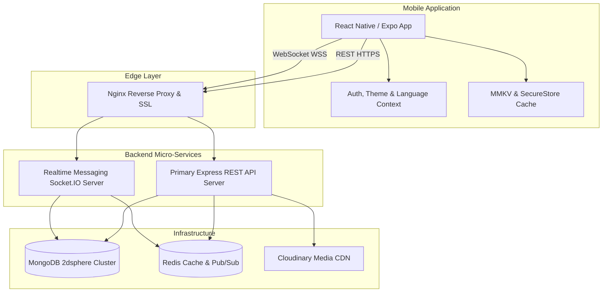

# Glunity Mobile — Celiac Community Ecosystem

[](https://expo.dev/)
[](https://nodejs.org/)
[](https://www.mongodb.com/)
[]()

> **Glunity** is a community-driven mobile ecosystem designed for individuals with celiac disease, gluten intolerance, food choices, and certified gluten-free commercial establishments in Tunisia and internationally.

---

## 📖 Master Documentation Hub

For full, in-depth technical specifications, sequence diagrams, data models, complete REST API route tables, and Socket.IO events, consult our master architecture docs:

* 📄 **[Master Architecture & Module Specification](docs/TECHNICAL_DOCUMENTATION.md)** — Complete module specifications, use cases, Mermaid diagrams, and endpoint reference.
* 📄 **[Engineering Design Doctrine](docs/architecture/engineering-ddoc.md)** — Security standards, performance guidelines, zero JS leakage, and UI principles.
* 📄 **[Real-Time Messaging Architecture](docs/architecture/messagerie/messaging_system_architecture.md)** — Socket.IO protocol, room strategies, and voice/media pipeline.
* 📄 **[Reels Module Architecture](docs/architecture/reels_module_architecture.md)** — Short vertical video scoring algorithm, comments tree, and OG previews.
* 📄 **[Admin Handoff Documentation](docs/audits/--@admin_handoff_documentation.md)** — Admin dashboard integration, health survey, and moderation system.

---

## 🌟 Key Product Features

| Feature Module | Description | Technical Highlights |
| :--- | :--- | :--- |
| **Collaborative Map** | Geo-safe discovery of GF restaurants, bakeries & shops | MongoDB GeoJSON `2dsphere` `$near` query, custom markers |
| **GF Product Database** | Verified product search with OCR ingredient analysis | Allergen flags, barcode lookup, seller catalog linking |
| **Real-Time Community** | Discord/Slack-style channels, voice notes & DMs | Socket.IO WebSocket cluster, Cloudinary audio CDN |
| **Reels Video Feed** | Vertical video feed with GF cooking & survival tips | Custom feed ranking algorithm, video compression pipeline |
| **Recipe Catalog** | Filterable recipes with nutrition breakdown & steps | Preparation time filters, favorites MMKV offline cache |
| **Events & Webinars** | Medical webinars, cooking workshops & meetups | Capacity tracking, attendee ticket QR/Pass generation |
| **Seller Dashboard** | Visibility analytics for commercial safe establishments | Impression counters, map click counters, product management |
| **Gamification Engine** | Warrior levels, streak trackers, badge unlock overlays | Daily check-in system, event-driven badge evaluation |

---

## 🏗️ Technical Architecture Overview

Glunity utilizes a **De-coupled Micro-Monolith Architecture** balancing backend developer velocity with high-concurrency real-time capabilities.



---

## 🛠️ Technology Stack

| Layer | Technology | Role |
| :--- | :--- | :--- |
| **Mobile Client** | React Native (Expo SDK 52) + TypeScript | Cross-platform iOS & Android client |
| **UI Framework** | Custom Design System + Glunity Theme Context | Pixel-perfect dark/light modes, zero raw hex |
| **State & Storage** | React Context + MMKV + SecureStore | Auth tokens in SecureStore, cache in MMKV |
| **Primary API** | Node.js + Express.js | Core REST API, business logic, Joi validation |
| **Real-Time Service**| Socket.IO + Express (Node.js) | High-performance WebSocket messaging service |
| **Database** | MongoDB + Mongoose | Primary data store with GeoJSON geospatial indexes |
| **Caching & Pub/Sub** | Redis | Rate limiting, session caching, Socket.IO adapter |
| **Media CDN** | Cloudinary | Image compression, voice note audio & video hosting |

---

## 📁 Repository Structure

```
glunity-mobile/
├── api/                       # Primary REST API (Express.js + MongoDB)
│   ├── src/
│   │   ├── app/
│   │   │   ├── modules/       # Domain modules (auth, locations, products, reels...)
│   │   │   ├── bootstrap/     # Database, Redis, Logger initialization
│   │   │   └── app.js         # Express app entrypoint
│   │   └── database/models/   # Mongoose schemas (User, Location, Product, Recipe...)
│   └── package.json
│
├── messaging-service/         # Standalone Real-Time Service (Socket.IO)
│   ├── src/
│   │   ├── modules/           # Channels, messages, voice notes
│   │   ├── realtime/          # Socket.IO event handlers & emitters
│   │   └── server.js          # Socket server entrypoint
│   └── package.json
│
├── mobile/                    # React Native Expo Application
│   ├── src/
│   │   ├── modules/           # Modular screen components (auth, map, community, reels...)
│   │   ├── shared/            # Reusable UI tokens, AppScaffold, AppHeader, buttons
│   │   └── core/              # Network client, i18n, storage, permissions
│   └── package.json
│
├── docs/                      # Technical Documentation & Specifications
│   ├── TECHNICAL_DOCUMENTATION.md  # Master Technical Architecture & API Matrix
│   └── architecture/          # Engineering ddocs & module deep-dives
│
├── deploy/                    # Nginx reverse proxy configuration & scripts
├── docker-compose.yml         # Containerized dev setup (MongoDB, Redis, API)
└── package.json               # Root workspace scripts
```

---

## ⚡ Quick Start & Development Setup

### Prerequisites
* **Node.js** >= 18.x
* **npm** >= 9.x
* **Docker & Docker Desktop** (for local MongoDB & Redis container instance)
* **Expo Go** app or iOS Simulator / Android Emulator

### 1. Clone & Install Dependencies
```bash
git clone https://github.com/Yassine-Drira/glunity-mobile-y.git
cd glunity-mobile-y
npm install
```

### 2. Environment Configuration
Copy sample environment files in `api/` and `messaging-service/`:

```bash
# Setup API env
cp api/.env.example api/.env

# Setup Messaging Service env
cp messaging-service/.env.example messaging-service/.env
```

### 3. Launch Local Infrastructure (MongoDB & Redis)
```bash
docker-compose up -d
```

### 4. Start Development Servers

Run all services in parallel via root workspace scripts:

```bash
# Start API & Messaging Backend
npm run start:dev

# In a separate terminal, start Mobile Expo App
npm --workspace mobile run start
```

---

## 🔒 Security & Quality Standards

1. **Dual-Token JWT Security:** Access tokens reside in memory; Refresh tokens are securely stored in `Expo SecureStore`.
2. **Zero JS Leakage:** All mobile code must be strictly typed TypeScript (`.tsx`/`.ts`).
3. **Theme Integrity:** No hardcoded color strings (e.g. `#FFFFFF`). All UI components consume `colors` from `useTheme()`.
4. **Client-Side Image Optimization:** Images are compressed and resized via `expo-image-manipulator` (max 1024px width) before sending to endpoints.
5. **No Unbounded Queries:** Every list endpoint enforces pagination (`?page=1&limit=20`).

---

## 📜 License & Operational Notice

*Glunity Ecosystem · Confidential & Proprietary · All Rights Reserved 2026*
