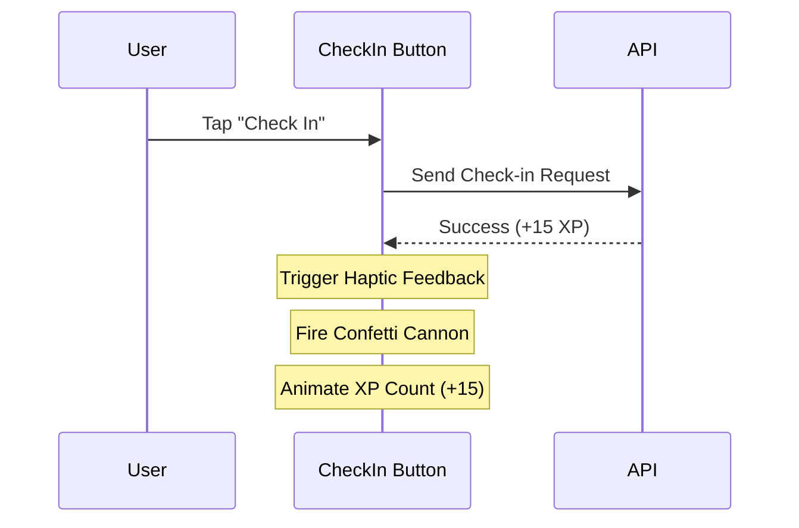

# UX Audit & Proposed Enhancements Report
**Evaluator:** Product Experience Lead & Senior UX Architect  
**Project:** Glunity Mobile App  
**Status:** Post-Layout Fixes (Symmetry & Text Scaling Optimized)

---

## 1. UX Rating Scorecard

| Category | Score | Notes / Status |
| :--- | :---: | :--- |
| **Visual Polish & Branding** | **7.8 / 10** | Beautiful cohesive color palette, modern typography (Poppins), and smooth card border-radii. Very premium-feeling surface elevations. |
| **Navigation & Flow** | **8.5 / 10** | Intuitive bottom tab bar with a prominent, floating scan action (FAB). Clear back navigation and screen structures. |
| **Accessibility & Localization** | **8.0 / 10** | Complete Arabic (RTL) and French support. Dynamic text scaling is now layout-safe and capped correctly to prevent overlap. |
| **Interactivity & Micro-Animations** | **6.5 / 10** | Lacks responsive micro-interactions (e.g., button feedback, active tabs, confetti, or sliding transitions). |
| **Gamification & Engagement** | **7.5 / 10** | Well-designed journey thresholds, check-in streaks, and medal grids. Needs more visual rewards for achievements. |
| **Performance & Load States** | **5.8 / 10** | Heavy use of blocking full-screen spinners. Lacks progressive or placeholder skeleton loading screens. |

### **Overall Experience Rating: 7.35 / 10** (Solid foundation, needs interactive delight)

---

## 2. User Journey Analysis

### 🟢 What Users Love (Strengths)
1. **The Dark Mode Integration:** Swapping themes feels natural and works across complex screens. The customized surface overrides prevent eye strain.
2. **Bi-Directional Fluency:** Toggling between English and Arabic transforms the layout order seamlessly without breaking alignment.
3. **The Quick Access Grid:** The two-column grid on the home screen provides immediate access to essential utilities (Scanner, Recipes, Calendar) with clean branding.
4. **Visual Streaks:** The fire streak icon and points tracker in the user and partner profiles provide instant positive reinforcement.

### 🔴 Where Users Feel Friction (Pain Points)
1. **The "Wait Screen" Fatigue:** When searching or loading resources, the app blocks the entire UI with a spinner, making the app feel slower than it is.
2. **Static Milestones:** Reaching a new XP level or unlocking a badge is silent—there is no visual celebration (e.g., level-up dialog, haptic feedback, or animations).
3. **Unclear Scanner CTA:** While the center scan button is visually distinct, first-time users are given no onboarding hint or context that scanning barcodes is the primary action.
4. **Search Experience:** The search bar in Patient Resources animates on toggle, but lacks instant suggestions or history, requiring full typing and a manual submission.

---

## 3. Prioritized UX Enhancement Plan

> [!NOTE]
> These enhancements focus on converting static layouts into a highly interactive, responsive, and delightful mobile experience.

### 🚀 Tier 1: High Impact, Low Effort (Quick Wins)

#### 1.1 Skeleton Loading Screens (Replacing Spinner Blocks)
*   **Concept:** Instead of full-screen spinners, render ghost cards (skeletons) that mimic the content layout (e.g., image block, title block, metadata lines).
*   **Benefit:** Reduces perceived wait time; users feel the app is loading instantly.
*   **Where to Implement:** `HomeScreen` sections, `PatientResourcesScreen` lists, and the `EventsCalendar` list.

#### 1.2 Multi-Sensory Action Feedback (Haptics)
*   **Concept:** Trigger subtle, native haptic feedback (using `expo-haptic-feedback` or `react-native-haptic-feedback`):
    *   *Light Tap:* Tab bar selections, filter chips.
    *   *Medium Tap:* Successful check-in, button taps.
    *   *Notification Success:* barcode scan success, badge unlock.
*   **Benefit:** Physical touch feedback makes the UI feel tactile and highly premium.

#### 1.3 Onboarding Coachmark (Scanner Guide)
*   **Concept:** On the first launch, render a subtle, animated pulsing glow around the center Scan FAB, accompanied by a small tooltip: *"Scan food barcodes to instantly detect gluten."*
*   **Benefit:** Increases direct feature adoption immediately.

---

### 🎨 Tier 2: Medium Effort, High Value (Interactive Polish)

#### 2.1 Check-In Confetti Celebration
*   **Concept:** When the user clicks the "Check In" button and successfully earns points:
    *   Temporarily render a canvas confetti burst (`react-native-confetti-cannon`).
    *   Play a short coin/unlock sound.
*   **Benefit:** Gamified delight that directly encourages daily active usage.

#### 2.2 Inline Search Autocomplete & Search History
*   **Concept:** Save the last 5 queries in `AsyncStorage`. When the user taps the search bar, show:
    *   Recent search tags.
    *   Instant filtered matching results under the input field as they type.
*   **Benefit:** Drastically reduces text entry friction, especially on smaller mobile screens.

---

### 💎 Tier 3: Advanced Polish (Premium Upgrades)

#### 3.1 Fluid Shared Element Transitions
*   **Concept:** When tapping a recipe card or event card, transition the image fluidly to the detail screen header using React Native Reanimated or Shared Element Transition.
*   **Benefit:** Emulates native iOS/Android system-level fluidity.

#### 3.2 Offline Cache Banner
*   **Concept:** Detect internet connectivity. If offline:
    *   Show a top border indicator: *"Viewing Cached Data (Offline)"*.
    *   Allow users to read previously loaded articles/recipes instead of failing.
*   **Benefit:** Provides uninterrupted support for users scanning items inside supermarkets with poor signal.
